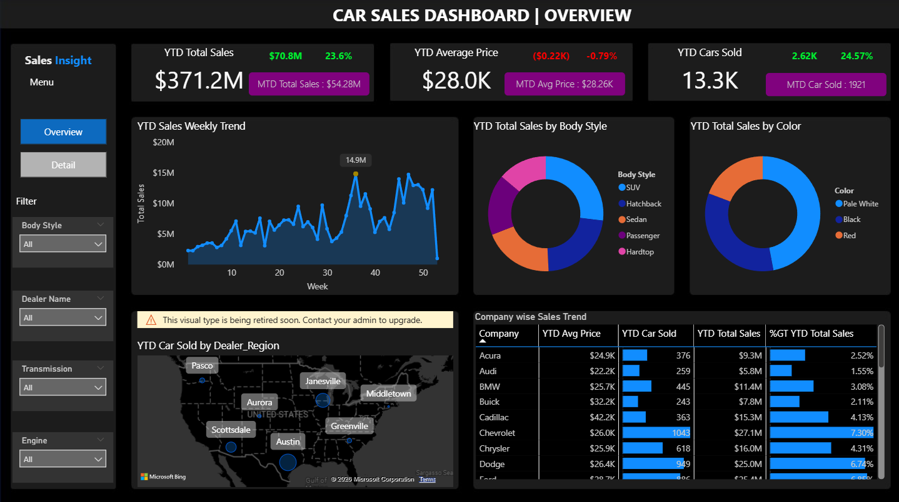
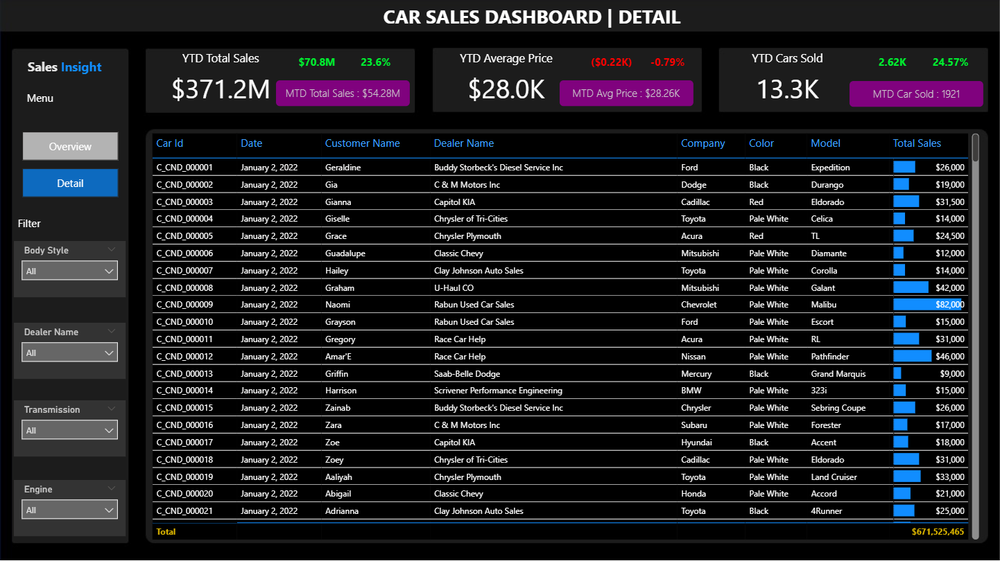

# 🚗 Car Sales Dashboard – Power BI

## 📌 Project Overview
This project presents an **interactive Car Sales Dashboard** developed using **Power BI** for a car dealership business.  
The dashboard focuses on **sales performance analysis, trend monitoring, and KPI tracking**, enabling stakeholders to make **data-driven decisions**.

This project demonstrates skills in:
- Business understanding
- KPI definition
- Data modeling
- DAX calculations
- Insight-driven reporting

---

## 🎯 Business Problem
The company needs a centralized dashboard to:
- Track sales performance in real time
- Compare current results with previous periods
- Identify trends, opportunities, and potential issues
- Support management decision-making with clear KPIs

---

## 🎯 Project Objectives
- Monitor **sales, pricing, and volume performance**
- Analyze **Year-to-Date (YTD), Month-to-Date (MTD), and Year-over-Year (YOY)** metrics
- Understand sales distribution by **product attributes and regions**
- Provide both **high-level KPIs** and **detailed transactional views**

---

## 🖼️ Dashboard Preview

---

## 📊 Key Performance Indicators (KPIs)

### 🔹 Sales Performance
- **YTD Total Sales**
- **MTD Total Sales**
- **YOY Growth (%)**
- **Difference between YTD and Previous YTD (PTYD)**

### 🔹 Pricing Analysis
- **YTD Average Price**
- **MTD Average Price**
- **YOY Growth in Average Price**
- **YTD vs PTYD Average Price Difference**

### 🔹 Sales Volume
- **YTD Cars Sold**
- **MTD Cars Sold**
- **YOY Growth in Cars Sold**
- **YTD vs PTYD Cars Sold Difference**

---

## 🔍 Key Insights
- Sales show **clear weekly and seasonal patterns**, useful for planning promotions and inventory.
- A small number of **body styles and colors drive a significant portion of revenue**.
- Regional analysis identifies **high-performing dealer regions** and potential growth areas.
- YOY comparisons reveal whether growth is driven by **price increases, volume growth, or both**.
- Average price trends help assess **pricing strategy effectiveness**.

---

## 🧠 Analytical Skills Demonstrated
- Translating business requirements into KPIs
- Time intelligence analysis (YTD, MTD, YOY)
- Comparative analysis vs previous periods
- Insight generation from visual patterns
- Designing dashboards for both executives and analysts

---

## 🛠️ Tools & Technologies
- **Power BI Desktop**
- **DAX**:
  - TOTALYTD
  - TOTALMTD
  - SAMEPERIODLASTYEAR
  - YOY Growth calculations
- **Data Modeling**:
  - Fact table: Car Sales
  - Dimension tables: Calendar Table

---
## 📚 References
- Data Tutorials – Power BI Car Sales Dashboard Tutorial  
  https://www.youtube.com/watch?v=uPkemycepLc&list=LL&index=2&t=3372s
